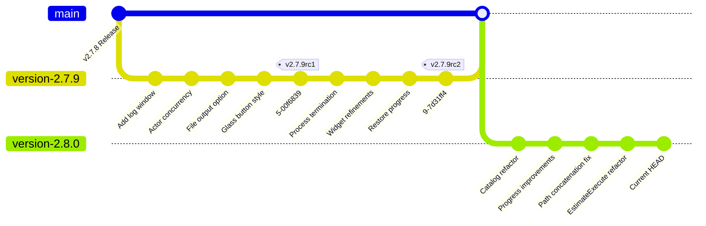

+++
author = "Thomas Evensen"
title = "Version 2.8.0"
date = "2025-12-02"
tags = ["changelog","version 2.8.0"]
categories = ["changelog"]
+++

### Version 2.8.0 (build 171) - Dec 2, 2025

*There is a new issue summarizing, by GitHub Copilot, all changes since version 2.7.8.*

The following summarizes changes in this release:

- The major update within this release is that all seven Swift Packages (SPM) are updated to version 2.0.
  - All SPM are validated by their own test, using the new Swift Testing framework.
- Several cleanups and refactorings have been made in the code.
  - There are approximately 17,000 lines of Swift code, and some code has not been reviewed for some time.
    - It has been about five years since I commenced development of RsyncUI, based on code end experience from my previous project.
    - I have learned a lot during these years, and now most of the code has been reviewed at least once since the start of development.
    - Almost every time I review old code, there are some refactorings, simplifications, and cleaning of the code.
- A bug in the restore data functionality has been resolved.
- Only one Widget is now available, Estimate and Execute.
- All synchronization, such as quicktask and restore, now includes a progress bar if there has been an estimate ahead.
- Real-time capture of rsync includes capturing to a file. Users can view either the RsyncUI logfile or the rsync capture to file in the view logfile.
- A gesture has been added to indicate when buttons are pressed.

Please be aware that real-time logging to file and view incurs a performance penalty. In certain instances, the termination signal may precede the complete draining of input from the filehandle, resulting in the absence of data for logging. While data synchronization is ensured, there may be no logging regarding the synchronization process.

My recommendation is to utilize this feature exclusively during the testing of new tasks and `—dry-run` tasks.

This feature is automatically disabled when the view is closed or switched off by buttons in the view.

### No stats

*There is more info about the upcoming maintenance release, version 2.8.1, about this issue in the blog about version 2.8.1*

The process termination signal indicates that the external rsync process has completed and the process has been terminated. All tasks within the main synchronize view are updated with the latest run, but there is also a separate logging that records the main result of each task with a timestamp.

Occasionally, when synchronizing a small amount of data to fast SSDs, the termination signal is detected before all output from rsync has been received. In such cases, the separate logging may be missing. After data synchronization and the absence of a log, you can verify the synchronization of data by recalculating the estimate. 

The process termination signal serves as a message to perform logging, but if the last summarized rsync output is missing, there is nothing to log. 

*Output from rsync* refers to the information that rsync provides to the terminal during the execution of a task.

Normally, the logging works as expected.

### Swift Packages

All SPM packages include their own testing mechanisms, and all tests have been successfully passed. SPM packages are generally small and focused on a specific purpose, which simplifies testing for edge cases and typical usage scenarios.

#### Main Repository

- RsyncUI (https://github.com/rsyncOSX/RsyncUI) - the main repository for RsyncUI

#### Swift Packages used by RsyncUI

All SPM packages are refactored, updated, and checked into the main branch. RsyncUI is a depended on all packages, but the last one is not mandatory. SSH keys can be generated via command line.

- *RsyncProcess* (https://github.com/rsyncOSX/RsyncProcess) - A minor package but a core function of RsyncUI
	- listens for output from the rsync process as well as termination signal
- *ProcessCommand* (https://github.com/rsyncOSX/ProcessCommand) - As above, but for commands other than rsync
- *RsyncArguments* (https://github.com/rsyncOSX/RsyncArguments) - Generate parameters for `rsync` based on configurations
- *DecodeEncodeGeneric* (https://github.com/rsyncOSX/DecodeEncodeGeneric) - Generic code for decoding and encoding JSON data
- *ParseRsyncOutput* (https://github.com/rsyncOSX/ParseRsyncOutput) - Parse and extract numerical values from the output of `rsync`
	- this data is used to display details and log results for synchronized tasks
- *RsyncUIDeepLinks* (https://github.com/rsyncOSX/RsyncUIDeepLinks) - Parse and return valid URL deeplinks to execute tasks directly within RsyncUI
- *sshCreateKey* (https://github.com/rsyncOSX/sshCreateKey) - Assist in creating an SSH identity file and key using RsyncUI
	- generate an RSA-based SSH key for default and user-defined keys, including the SSH port number

# Development Summary: v2.7.8 → v2.8.0

## Overview

This issue summarizes the major development work completed since the release of version 2.7.8, including architectural improvements, UI enhancements, and new features leading toward version 2.8.0.

## 📊 Development Statistics

## 🏗️ Major Feature Areas

```mermaid
mindmap
  root((v2.7.8 → v2.8.0))
    Progress Tracking
      RestoreProgressView
      SynchronizeProgressView
      Max value support
      Real-time updates
    Logging System
      Dedicated log window
      Actor-based concurrency
      File output option
      Delete optimization
    Architecture
      Params struct
      SSHParams refactor
      Actor concurrency
      Path handling
    UI Refinements
      Glass button style
      Dynamic text colors
      Toolbar layouts
      Progress indicators
    Widget System
      Remove WidgetVerify
      URL handling updates
      DeepLinks improvements
```

## 🔄 Development Flow

## 📦 Major Refactoring Initiatives

### 1. Architecture & Code Organization

### 2. Progress Tracking System Enhancement

### 3. Logging System Modernization

## 🎨 UI/UX Improvements

## 🔧 Technical Improvements

### Parameter Handling Refactor

**Before:**
- Parameters scattered across multiple classes
- Inconsistent SSH parameter creation
- Duplicated argument construction logic

**After:**
- Centralized `Params` struct
- Dedicated `SSHParams` struct
- Consistent parameter construction
- Better code reusability

### Concurrency Model

**Key Changes:**
- Introduction of Actor-based concurrency for log management
- `DeleteLogrecords` actor for safe log deletion
- `ActorReadLogRecordsJSON` optimization
- Thread-safe state management

### Path Handling

**Improvements:**
- URL extension for home directory access
- Fixed config path concatenation
- Better catalog path logic
- Unified path handling approach

## 🗑️ Cleanup & Removal

## 📈 Commit Activity Timeline

```mermaid
gantt
    title Development Timeline (v2.7.8 → v2.8.0)
    dateFormat  YYYY-MM-DD
    section Logging System
    Actor concurrency & log management    :done, 2024-10-01, 2024-10-15
    Dedicated log window                  :done, 2024-10-15, 2024-10-25
    File output & optimization            :done, 2024-10-25, 2024-11-05
    
    section Architecture
    Params & SSHParams refactor           :done, 2024-10-20, 2024-11-10
    Service layer improvements            :done, 2024-11-15, 2024-11-25
    
    section UI/UX
    Glass button & animations             :done, 2024-10-28, 2024-11-08
    Progress tracking enhancements        :done, 2024-11-10, 2024-11-25
    
    section Progress System
    Restore progress view                 :done, 2024-11-12, 2024-11-20
    Synchronize progress extraction       :done, 2024-11-22, 2024-11-28
    Max value support                     :done, 2024-11-28, 2024-12-02
    
    section Cleanup
    Widget removal & refinements          :done, 2024-11-05, 2024-11-15
    Code cleanup & optimization           :done, 2024-11-20, 2024-12-02
```

## 🎯 Key Achievements

1. **✅ Enhanced Progress Tracking**
   - New `RestoreProgressView` for better restore operation visibility
   - Extracted `SynchronizeProgressView` to separate file
   - Added max value support for accurate progress percentages
   - Improved UI progress indicators across all views

2. **✅ Modern Logging System**
   - Dedicated log window for better log management
   - Actor-based concurrency for thread-safe operations
   - File output option for persistent logging
   - Optimized log deletion with batch processing

3. **✅ Architectural Improvements**
   - Introduced `Params` struct for centralized parameter management
   - Created `SSHParams` struct for SSH handling
   - Refactored catalog and volume models with service layer
   - Improved error handling and method naming consistency

4. **✅ UI Polish**
   - Glass button style with sustained pressure animations
   - Dynamic text colors for better visual feedback
   - Refined toolbar layouts across multiple views
   - Increased sheet view heights for better content display

5. **✅ Code Quality**
   - Removed deprecated widget components
   - Fixed path concatenation issues
   - Eliminated unused code and environment variables
   - Improved code organization and modularity

## 🔍 Code Quality Metrics

## 🚀 Next Steps for v2.8.0

- [x] Final testing of all refactored components
- [ ] Performance benchmarking of actor-based logging
- [ ] User acceptance testing of new progress views
- [x] Documentation updates
- [x] Release notes preparation

## 📝 Notes

- Two release candidates (v2.7.9rc1 and v2.7.9rc2) were created during development
- The current branch `version-2.8.0` is actively being developed
- All changes maintain backward compatibility with existing configurations
- Swift package dependencies have been updated to their latest stable versions

---

**Total Commits:** 70  
**Files Changed:** ~150+  
**Primary Focus Areas:** Architecture, UI/UX, Logging, Progress Tracking  
**Development Period:** Post v2.7.8 release → Present